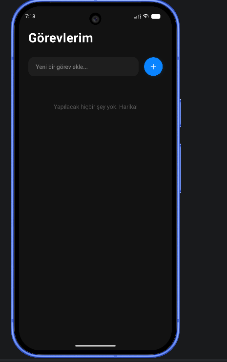
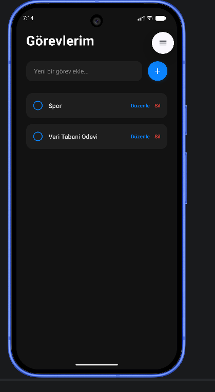
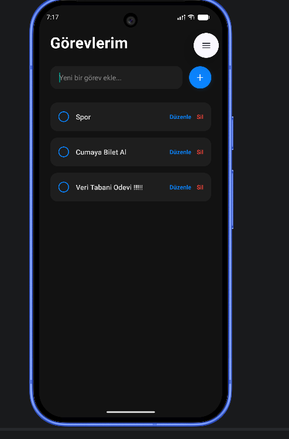
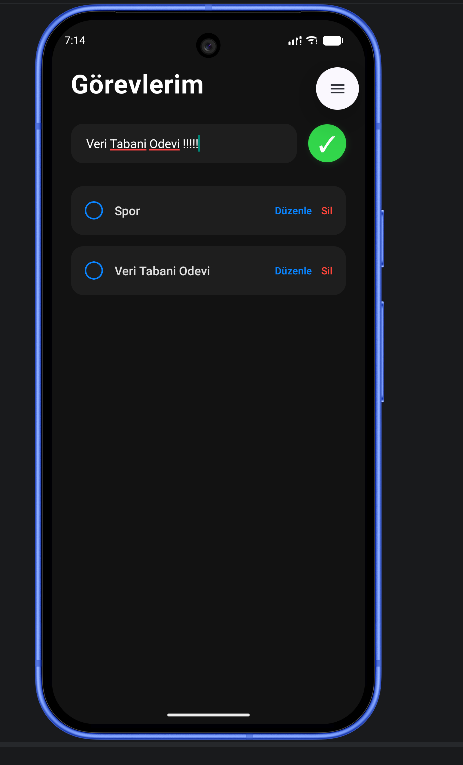
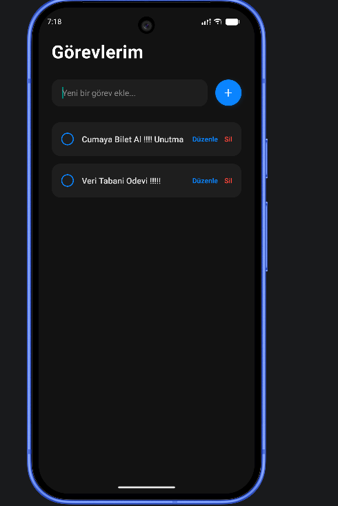
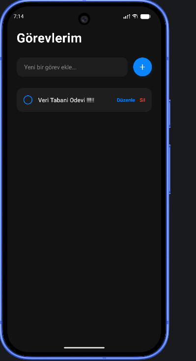

# Görevlerim - Dark Mode React Native To-Do List

Bu proje, Veri Tabanı Yönetim Sistemleri dersi ödevi kapsamında geliştirilmiş, React Native ve yerel SQLite veritabanı kullanılarak hazırlanan modern karanlık temalı (Dark Mode) bir yapılacaklar listesi uygulamasıdır.

## Özellikler (CRUD İşlemleri & Durum Yönetimi)
Uygulama, yerel veritabanı (offline) üzerinde tam kapsamlı veri yönetimi yapabilmektedir:
* **Create (Ekleme):** Kullanıcılar günlük görevlerini sisteme hızlıca ekleyebilir.
* **Read (Okuma):** Eklenen görevler veritabanından çekilerek ana ekranda liste halinde görüntülenir. Yapılmayan görevler önceliklidir.
* **Update (Güncelleme):** * Görevlerin sol tarafındaki yuvarlak butona basılarak görev **Yapıldı (✅)** veya **Yapılmadı (⬜)** olarak işaretlenebilir (üzeri çizilir).
  * Mevcut bir görev "Düzenle" butonuna basılarak seçilebilir ve içeriği güncellenebilir.
* **Delete (Silme):** İstenilmeyen veya tamamlanan görevler "Sil" butonu ile veritabanından kalıcı olarak temizlenebilir.

## 📸 Ekran Görüntüleri

Aşağıda uygulamanın çalışma adımlarına ait ekran görüntüleri bulunmaktadır:

| Anasayfa (Boş) | Yeni Görev Ekleme | Görev Listesi ve Durumlar |
| :---: | :---: | :---: |
|  |  |  |

| Güncelleme İşlemi | Güncelleme Sonrası | Silme İşlemi Sonrası |
| :---: | :---: | :---: |
|  |  |  |

